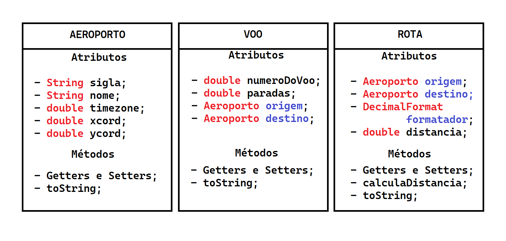

# Relatório do Trabalho de Estrutura de Dados 2

O Relatório a seguir é referente ao trabalho de Estrutura de Dados 2, com o objetivo de clarificar a representação e implementação de grafos.

## Estruturas

Foram usados na implementação do trabalho, 5 classes 3 delas contendo os atributos e métodos de cada artefato (Aeroporto, Voo e Rota). A quarta classe (Carregador) carrega os artefatos de arquivos texto em listas (ArrayList). A quinta classe implementa os algorítmos de relatório. Segue o diagrama de classes básicas: 

 

